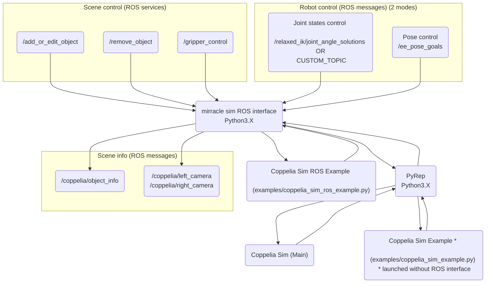

# Coppelia Sim ROS Interface

Package build on top of _CoppeliaSim_ simulator using mostly [PyRep](https://github.com/stepjam/PyRep) package to communicate with the simulator. Enables control of a simulator via ROS messages and services.

Package provides possibility to manage scene objects and robot control.

##### Diagram of the nodes in package:



## Installation

If you use Teleoperation gesture toolbox, use installation there, otherwise:

1. Install CoppeliaSim
2. Install PyRep
3. Download this package into ROS workspace
4. Install conda packages based on `environment.yml` file.

## Usage:

- Example launch server & client.

1. Run _CoppeliaSim_ example without ROS.

```
cd <coppelia_sim_ros_interface>/examples
python coppelia_sim_example.py
```

2. Run _CoppeliaSim_ example with ROS.

```
roslaunch coppelia_sim_ros_interface example.launch
```

- Launch only server
- Using your own script

```
roslaunch coppelia_sim_ros_interface coppelia_sim.launch
```

Example Python function that can be used to communicate with interface are in [lib file](src/coppelia_sim_ros_client.py).

Use-case can be found in `coppelia_sim_ros_example.py`

## Interface via ROS:


### Robot control

##### Message

1. (_ROSparam_) IK_solver: `'pyrep'`

Publish on `/pose_eef` type _Pose_ to move robot target based on pose control. Recommended.

2. (_ROSparam_) IK_solver: `'relaxed_ik'`

Publish on `/relaxed_ik/joint_angle_solutions` type _JointAngles_ for joints control. _JointAngles_ type message can be found in [file](msg/JointAngles.msg).

3. (_ROSparam_) IK_solver: `'custom'`

Publish on topic described by (_ROSparam_) `/mirracle_config/ik_topic` type _JointAngles_.

### Camera images

##### Message

Subscribe on `/coppelia/left_camera` and `/coppelia/right_camera` to receive Camera Images type `Image`.

To view camera image, `image_view` can be used with command:
`rosrun image_view image_view image:=/coppelia/left_camera`

Call service `/add_or_edit_object` with argument `name='camera'` and argument `pub_info='true'`. (Template function in [lib](src/coppelia_sim_ros_client.py))

### Object info

##### Message

Subscribe on `/coppelia/object_info` to receive info about objects.

Call service `/add_or_edit_object` with argument `name='<object_name>'` and argument `pub_info='true'` to receive info about object. (Template function in [lib](src/coppelia_sim_ros_client.py))

### Add or Edit object

##### Service

Creates or edit object on scene.
If name given does not exist, the object will be created.
Service name: `/add_or_edit_object`
Service type: **AddOrEditObject** from coppelia_sim_ros_interface.srv
Service description: [file link](srv/AddOrEditObject.srv)
For calling, template function in [lib](src/coppelia_sim_ros_client.py)

Creation priority is:
 1. mesh file
 2. shape
 3. if both mesh & shape not given, a box is created


### Remove object

##### Service

Removes an object from the scene.

Service name: `/remove_object`
Service msg type: **RemoveObject** from coppelia_sim_ros_interface.srv
Service description: [file link](srv/RemoveObject.srv)
For calling, template function in [lib](src/coppelia_sim_ros_client.py)


### Gripper control

##### Service

Service name: `/gripper_control`
Service msg type: **GripperControl** from coppelia_sim_ros_interface.srv
Service description: [file link](srv/GripperControl.srv)
For calling, template function in [lib](src/coppelia_sim_ros_client.py)

Use parameter `position` as `0.0` for closed gripper and `1.0`  for opened gripper. Use effort between `0.0-1.0`.
Use action `grasp` or `release` to attach object to eef. Specify object as `object` parameter.
